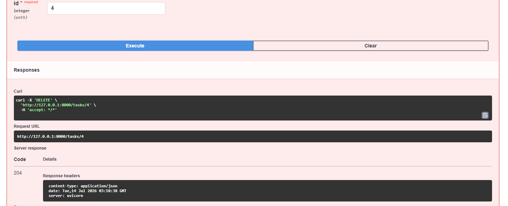
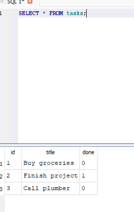

# Task API

A small CRUD API built with FastAPI that manages a to-do list, backed by a SQLite database. Supports creating, reading, updating, and deleting tasks, with interactive documentation via Swagger UI.

## What this is

This API demonstrates the four CRUD operations (Create, Read, Update, Delete) mapped onto HTTP methods (POST, GET, PUT, DELETE). Tasks are stored in a SQLite database (`tasks.db`), so data survives server restarts.

## How to run it

Clone the repo and install dependencies:

```
git clone https://github.com/Eddie-Richardson/CRUD-API.git
cd CRUD-API
pip install -r requirements.txt
```

Start the server:

```
fastapi dev main.py
```

The API will be running at `http://localhost:8000`. On first run, `tasks.db` is created automatically in the project root, and 3 example tasks are seeded.

## Endpoints

| Method | Path           | Description                        |
|--------|----------------|-------------------------------------|
| GET    | `/`            | API metadata                       |
| GET    | `/health`      | Health check                       |
| GET    | `/tasks`       | List tasks (supports search, filter, sort — see below) |
| GET    | `/tasks/{id}`  | Get a single task by ID            |
| GET    | `/stats`       | Task counts (total, done, not done)|
| POST   | `/tasks`       | Create a new task                  |
| PUT    | `/tasks/{id}`  | Update a task's title and/or done  |
| DELETE | `/tasks/{id}`  | Delete a task                      |

### Query parameters on `GET /tasks`

| Param    | Example                  | Description                                      |
|----------|--------------------------|---------------------------------------------------|
| `search` | `?search=milk`           | Case-insensitive partial match on title           |
| `done`   | `?done=true`             | Filter to only done (`true`) or not-done (`false`) tasks |
| `sort`   | `?sort=title`            | Sort results alphabetically by title              |

These can be combined, e.g. `GET /tasks?search=o&done=false&sort=title`.

Every task also includes `created_at` and `updated_at` timestamps (ISO 8601, UTC). `updated_at` changes on any PUT; `created_at` never changes after creation.

## Example request

```
curl.exe --% -i -X POST http://localhost:8000/tasks -H "Content-Type: application/json" -d "{\"title\":\"Buy milk\"}"
```

```
HTTP/1.1 201 Created
date: Tue, 14 Jul 2026 02:54:09 GMT
server: uvicorn
content-length: 40
content-type: application/json

{"id":4,"title":"Buy milk","done":false,"created_at":"2026-07-14T02:54:09.123456","updated_at":"2026-07-14T02:54:09.123456"}
```

## Swagger UI

FastAPI automatically generates interactive API documentation at `/docs`. The full CRUD cycle (create, list, update, delete) was tested there using the "Try it out" feature.



## Persistence

Tasks are stored in a SQLite database instead of an in-memory list.

**Why SQLite:** it requires no separate database server, just a single file on disk. That means anyone cloning this repo can run the project immediately with no setup beyond installing Python dependencies, which fits a project this size. SQLAlchemy handles the connection and queries (`database.py`), so swapping to a different database later (Postgres, for example) would mean changing one connection string, not rewriting the API.

**Where it's stored:** `tasks.db`, created automatically in the project root the first time the app starts. It's excluded from version control via `.gitignore`.

**Example query**, run directly against `tasks.db` in DB Browser for SQLite:

```sql
SELECT * FROM tasks WHERE done = 1;
```



## Notes

- Data now persists in SQLite across server restarts. The seed tasks are only inserted once, on the very first run against an empty database.
- Known limitation: there's no concurrency control yet if two clients tried to update the same task at the same time. Not an issue with a single user, but something to add before this runs with multiple people accessing it.
